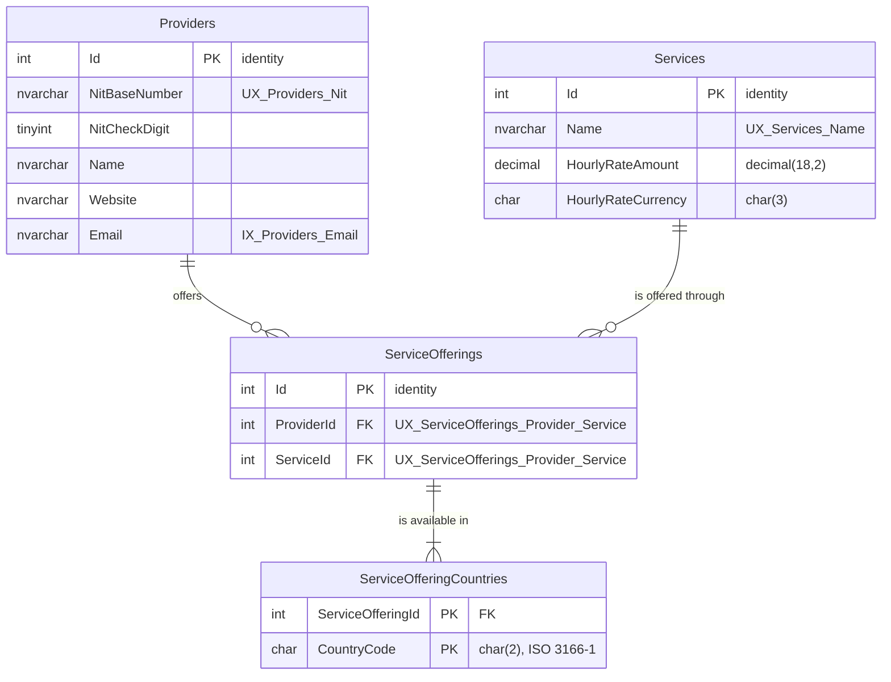

# ProviderHub

Manage the providers of TEKUS S.A.S., the services each one offers, in which countries, and at
what hourly rate. Built for the Tekus .NET fullstack technical test.

**.NET 10 · Angular 21 · SQL Server 2022 · Clean Architecture · 224 tests**

## Run it

You need [Docker](https://www.docker.com/products/docker-desktop/), the
[.NET 10 SDK](https://dotnet.microsoft.com/download) and [Node 20+](https://nodejs.org).

**1. Database.** Starts SQL Server, creates the schema and loads the sample data
(10 providers, 12 services, 26 offerings):

```bash
docker compose up -d --wait
```

```bash
dotnet ef database update --project src/ProviderHub.Infrastructure
```

```bash
docker exec -i providerhub-sqlserver //opt/mssql-tools18/bin/sqlcmd -S localhost -U sa -P "ProviderHub!2026" -C -d ProviderHub -b < db/seed.sql
```

Two notes on that last one. The leading `//` is deliberate: Git Bash on Windows rewrites an
argument that starts with a single `/` into a Windows path, and the doubled slash stops it while
meaning the same thing everywhere else. And if `dotnet ef` is not found,
`dotnet tool install --global dotnet-ef` installs it.

**2. API.** Leave it running:

```bash
dotnet run --project src/ProviderHub.Api
```

**3. Web application.** In a second terminal, leave it running too:

```bash
cd frontend
```

```bash
npm install
```

```bash
npm start
```

Then open **<http://localhost:4200>** and sign in with **`admin`** / **`Tekus2026!`**.

| | |
| --- | --- |
| Web application | <http://localhost:4200> |
| API documentation | <http://localhost:5199/scalar/v1> |
| Notification e-mails | `src/ProviderHub.Api/outbox/*.eml` |

The credentials are committed on purpose: they only ever reach a container bound to localhost, and
a reviewer cloning this repository should be able to run it without being handed a secret out of
band. Nothing outside local development reads them.

### A five-minute tour

1. **Sign in with the wrong password first.** The message comes from the server, and it is the
   same one whether the user or the password was wrong.
2. **Dashboard.** Both indicators the test asks for, counted by SQL Server in one grouped query.
3. **Services → sort by hourly rate, then search.** Both happen on the server, over the whole
   table rather than the page on screen.
4. **Create a service named `Orbital data relay`.** It already exists, so the API answers `409`
   and the message lands above the form.
5. **Create a provider with NIT `123456789-1`.** The check digit is wrong; the domain says so,
   and the message lands on the NIT field. The right one for that number is `-6`.
6. **Open a provider and offer it a service.** Look in `outbox/` afterwards: enabling a service
   raises a domain event, and the notification e-mail is written once the change is committed.

## Tests

```bash
dotnet test
```

```bash
cd frontend
```

```bash
npm test
```

191 backend tests and 33 frontend ones. The unit tests need nothing but the SDK; the persistence
and end-to-end tests need the database container, and are skipped rather than failed without it,
so cloning the repository and running `dotnet test` never looks like broken code.

## Stack

| Layer | Technology |
| --- | --- |
| Backend | .NET 10 / ASP.NET Core Web API |
| Persistence | Entity Framework Core + SQL Server 2022 |
| Frontend | Angular (standalone components) + Angular Material |
| Tests | xUnit |
| Local infrastructure | Docker Compose |

## Solution layout

The backend follows Clean Architecture with a DDD-oriented domain layer.
Dependencies always point inwards: nothing in `Domain` knows about the outside world.

```
ProviderHub.sln
├── frontend                         Angular 21 application (standalone, Material 3)
├── src
│   ├── ProviderHub.Domain           Entities, value objects, business rules. No dependencies.
│   ├── ProviderHub.Application      Use cases, DTOs, validation. Declares the ports (interfaces).
│   ├── ProviderHub.Infrastructure   Adapters: EF Core, SMTP, external services.
│   └── ProviderHub.Api              HTTP endpoints, authentication, DI composition root.
└── tests
    ├── ProviderHub.Domain.Tests           Business rules. No dependencies, milliseconds.
    ├── ProviderHub.Application.Tests      Use cases against in-memory repositories.
    ├── ProviderHub.Infrastructure.Tests   Mapping, indexes and SQL, against a real SQL Server.
    └── ProviderHub.Api.IntegrationTests   End to end, over HTTP.
```

`Api` is the only project allowed to reference `Infrastructure`, and it does so purely to
register implementations in the DI container at startup.

## Domain model

```
Provider (aggregate root)          Service (aggregate root)
  Nit          value object          Name
  Name                               HourlyRate   value object (Money)
  Website      value object
  Email        value object
  Offerings ──┐
              │
              └── ServiceOffering (entity, inside the Provider aggregate)
                    ServiceId   ──────────────────────────► Service
                    Countries   value objects (CountryCode)
```

Two decisions are worth calling out, because the statement of the test does not settle them.

**Where the country lives.** The test asks for indicators "by country" but never defines a
country field on any entity. It is modelled here on the relationship: a provider offers a given
service in a given set of countries. A provider may therefore offer consulting across Colombia
and Mexico while offering auditing only in Peru, which is both closer to reality and what makes
the two summary indicators answerable. The consequence is that `ServiceOffering` is a real
entity carrying its own data, not a plain join row.

**Why `Service` is its own aggregate root.** Several providers can offer the same catalogue
entry, so a service exists independently of any provider. Offerings reference it by identifier
rather than holding it, which keeps the two aggregates loosely coupled: one transaction changes
one aggregate.

Country codes follow ISO 3166-1 alpha-2 so that the indicators aggregate reliably; free text
would turn "Colombia", "colombia" and "COL" into three different countries. NIT check digits are
verified with the official algorithm rather than merely stored.

## Use cases

Each operation the system can perform is one class in `Application`, holding its command, its
validator and its handler in a single file. The list of files under `UseCases` is therefore the
list of things the system does.

**No mediator.** A mediator was considered and left out: with eleven use cases, `Send(command)`
only adds a layer of indirection over calling the handler, at the cost of losing compile-time
knowledge of who handles what. MediatR would also have brought a licence (RPL-1.5, or
commercial) that a project this size does not need to take on. The pattern it usually carries,
one handler per use case, is applied here directly.

**Validation happens twice, on purpose.** `Application` validates the incoming request with
FluentValidation so the caller receives a single `400` listing every field that is wrong.
`Domain` validates again when building its value objects, because it cannot trust that it is
only ever called through the API. The rules are not written twice: the validators ask the domain
to build the value and report its message, so a rule like the NIT check digit exists in exactly
one place.

**Errors are expressed in the language of the application**, not of HTTP: `NotFoundException`,
`ConflictException` and FluentValidation's `ValidationException`. Turning them into 404, 409 and
400 is the API layer's job, which keeps the use cases runnable from a job or a test.

## API

| Verb | Route | What it does |
| --- | --- | --- |
| GET | `/api/providers` | List, paged, searchable and sortable |
| POST | `/api/providers` | Register a provider |
| GET | `/api/providers/{id}` | One provider with everything it offers |
| PUT | `/api/providers/{id}` | Edit its identifying and contact details |
| POST | `/api/providers/{id}/services` | Enable a service in a set of countries |
| PUT | `/api/providers/{id}/services/{serviceId}` | Replace the countries of an offering |
| DELETE | `/api/providers/{id}/services/{serviceId}` | Stop offering a service |
| GET | `/api/services` | Catalogue, paged, searchable and sortable |
| POST | `/api/services` | Add a catalogue entry |
| GET | `/api/services/{id}` | One catalogue entry |
| PUT | `/api/services/{id}` | Edit its name or hourly rate |
| GET | `/api/{providers\|services}/sort-fields` | Which fields that list can be sorted by |
| GET | `/api/summary` | Totals, and both indicators broken down by country |
| POST | `/api/auth/login` | Exchange credentials for a token. The only anonymous endpoint |
| GET | `/api/auth/me` | Who the current token belongs to |

Every list accepts `?page=&pageSize=&search=&sortBy=&direction=asc|desc`, and answers with the
rows plus `totalCount`, `totalPages`, `hasNextPage` and `hasPreviousPage`, so a client can render
a pager without a second request or a guess.

**Failures are always `ProblemDetails`** (RFC 9457), whichever endpoint produced them. The
translation from the language of the application to status codes happens in one place, so no
endpoint can forget it and no two endpoints can disagree:

| Raised by a use case | Answer |
| --- | --- |
| `ValidationException` | `400` with an `errors` object, one entry per field |
| `InvalidCredentialsException` | `401`, with the same message whichever half was wrong |
| `NotFoundException` | `404` |
| `ConflictException` | `409` |
| `DomainException` | `400`, and a log entry: a validator upstream is missing |
| anything else | `500` with no detail, and the exception in the logs |

A rejected request names every problem at once rather than the first one:

```json
{
  "title": "One or more validation errors occurred.",
  "status": 400,
  "errors": {
    "nit": ["The check digit of NIT '890903938-1' is wrong, expected 8."],
    "name": ["'Name' must not be empty."],
    "website": ["'javascript:alert(1)' must use the http or https scheme."],
    "email": ["'not-an-email' is not a valid e-mail address."]
  }
}
```

Interactive documentation is served at `/scalar/v1` in development, generated from the OpenAPI
document and the XML comments on the controllers.

## Frontend

An Angular 21 application under [`frontend/`](frontend), standalone components throughout, with
Angular Material 3 as the pre-existing design system the test asks for.

The dev server proxies `/api` to `http://localhost:5199`, so the browser sees one origin and CORS
never enters the picture. In production the application is served behind the same host.

### Screens

| Route | What it does |
| --- | --- |
| `/` | Dashboard: the totals and both country indicators |
| `/login` | Sign in. The only route a visitor without a token can reach. |
| `/providers` | Paged, searchable, sortable table with the countries each provider reaches |
| `/providers/:id` | One provider, and the services it offers: add, change countries, withdraw |
| `/services` | The catalogue, paged, searchable, sortable, with create and edit |

The dashboard draws its bars with CSS rather than a charting library. Two columns of numbers do
not justify the weight, the bundle or the theming work of one, and each bar is scaled against the
largest value in its own column, so the shape of the distribution is what the eye picks up. The
bars carry `aria-hidden`, because the number beside them already says the same thing and a screen
reader should not read it twice.

**Paging, searching and sorting happen on the server.** Sorting a page of twenty rows in the
browser sorts twenty rows, not the ten thousand behind them. The screens turn gestures into query
parameters; `mat-paginator` is told the total the API reported, not the number of rows on screen.
Typing is debounced, so a search is one request per pause rather than one per keystroke, and
`switchMap` cancels the request in flight so a slow answer cannot overwrite a newer one.

**The errors the API sends land on the fields that caused them.** A rejected form comes back with
one entry per offending field, and each message is attached to its own control instead of piling
into a banner the user has to match up by hand. A `409` has no field errors at all, so a
duplicated name or NIT is shown above the form, where it belongs.

**Business rules are not copied into the browser.** The NIT check digit is validated on the
server and nowhere else: a second implementation in TypeScript would be a second place for it to
be wrong. The client checks shape and presence, which is what makes the form feel quick; the
server checks the rule and sends back its own message.

### Under the hood

Three decisions shape the code:

**State lives in signals.** `auth.isSignedIn()` is read straight from a template and Angular
tracks the dependency itself, so no component subscribes and none has to remember to unsubscribe.

**One interceptor attaches the token, once.** It runs for calls to this API only: a URL that
merely passes through must not carry the session to a third party. When the API answers `401`,
the same interceptor ends the session, because staying put would mean every later request failing
the same silent way.

**The route guard is a convenience, not a security control.** Everything it protects is a screen;
the data behind those screens is protected by the API, which refuses any request without a valid
token. A guard that can be bypassed by editing the URL would be the only thing in the way if the
server trusted the client, and it does not.

The session is kept in `localStorage` so it survives a reload. That is a deliberate trade and
worth stating: anything in `localStorage` is readable by any script on the page, so an XSS hole
would hand the token over. The stronger arrangement is an `HttpOnly` cookie, which JavaScript
cannot read, and it needs the server to issue and validate cookies plus CSRF protection. For a
bearer-token API of this size, storage is the honest compromise.

## Authentication

The test asks for an authentication mechanism and explicitly does not ask for user
administration, so there is one user, defined in configuration, and no way to create more.

```bash
curl -X POST http://localhost:5199/api/auth/login -H "Content-Type: application/json" -d "{\"userName\":\"admin\",\"password\":\"Tekus2026!\"}"
```

The response carries a JWT to send back as `Authorization: Bearer <token>` on every other
endpoint. In the documentation page, paste it into the **Authorize** box.

Four decisions here are worth more than the code that implements them:

**Authorization is the default, not an opt-in.** A global filter requires an authenticated user,
and `[AllowAnonymous]` waives it on the login endpoint alone. The other way round, an endpoint
added next month is public until somebody remembers to protect it, and nothing fails to remind
them.

**The password is never stored.** Configuration holds a PBKDF2-HMAC-SHA256 hash with a random
salt and 210,000 iterations, in a self-describing `iterations.salt.hash` format so the cost can
be raised later without invalidating what already exists. Verification compares in constant time,
because the duration of a rejection should not reveal how close a guess was.

**A wrong username and a wrong password fail identically.** Distinguishing them turns the login
form into a way of discovering which accounts exist.

**Every validation the token library offers is switched on**: issuer, audience, signature and
lifetime, with the default five minutes of clock skew cut to thirty seconds. Each of these is off
by default in somebody's tutorial, and each one left off turns the token into a decoration.

Secrets live in `appsettings.Development.json` for local work only; `appsettings.json` carries no
signing key, so a deployment must supply one through the environment and fails at startup if it
does not.

## Notifications

When a provider enables a service, an e-mail goes to the address named in the system
preferences. Nothing about that lives in the domain: `Provider.OfferService` records a
`ServiceOfferedDomainEvent` and moves on, and a handler in the application layer decides that
somebody should hear about it. Adding a second reaction, an audit entry or a webhook, is one
registration and no change to the model.

**Events are published after the commit, never before.** `UnitOfWork` collects what the
aggregates recorded, saves, and only then dispatches:

```
collect events → SaveChanges → clear events → dispatch
```

A handler announces something as true. Run inside the transaction, a later rollback would turn
that announcement into a lie, and there is no way to un-send a message. The reverse risk is real
and accepted: a process that dies between the commit and the dispatch loses the notification.
Closing that gap needs an outbox table written in the same transaction and drained by a
background worker — the right answer when a missed notification costs money, and more machinery
than this system earns. A test asserts the ordering by having the dispatcher read the database
through a second connection and find the row already there.

**A failing handler cannot fail the request.** By the time it runs the work is committed, so the
dispatcher logs the failure and lets the remaining handlers take their turn. A mail server that
is down must not reject a provider registration that succeeded.

In development, e-mail is written to `outbox/` as `.eml` files rather than sent, so the project
runs and its tests pass with no SMTP server anywhere. `Notifications:Transport` switches to
`Smtp` for a real one.

```
From: no-reply@providerhub.local
To: operations@tekus.co
Subject: Nueva Empresa S.A.S. has enabled a new service

Provider: Nueva Empresa S.A.S.
NIT: 900123456-8
Service: Orbital data relay
Available in: Colombia, Mexico, Peru
Hourly rate: 340.00 USD
```

## Summary indicators

`GET /api/summary` answers the two indicators the test asks for: **how many distinct services are
offered in each country**, and **how many providers offer something there**, alongside headline
totals.

```json
{
  "totals": { "providerCount": 10, "serviceCount": 12, "offeringCount": 26, "countryCount": 13 },
  "byCountry": [
    { "countryCode": "CO", "countryName": "Colombia", "serviceCount": 11, "providerCount": 9 },
    { "countryCode": "PE", "countryName": "Peru",     "serviceCount": 5,  "providerCount": 5 }
  ]
}
```

This is where the modelling decision of the first commit pays off. The country lives on the
offering, so both indicators fall out of one grouped query; a country field on the provider would
have answered the second and left the first with no honest answer.

The read side has its own port, `ISummaryQueries`, deliberately separate from the repositories.
A repository returns aggregates because the write side needs them to enforce rules; asking one
for every provider and counting in memory would load the database to produce four numbers, and
get slower exactly as the data grows. Same idea as CQRS without the machinery: two models over
one set of tables. The counting is left to SQL Server:

```sql
SELECT [s0].[CountryCode],
       COUNT(DISTINCT [s].[ServiceId])  AS [ServiceCount],
       COUNT(DISTINCT [p].[Id])         AS [ProviderCount]
FROM [Providers] AS [p]
INNER JOIN [ServiceOfferings] AS [s]          ON [p].[Id] = [s].[ProviderId]
INNER JOIN [ServiceOfferingCountries] AS [s0] ON [s].[Id] = [s0].[ServiceOfferingId]
GROUP BY [s0].[CountryCode]
```

`DISTINCT` is not decoration: a provider offering three services in Colombia is one provider
there, not three.

## Database



Value objects are mapped as owned types, which keeps their parts as real columns: a value
converter would collapse `Nit` into an opaque string that no query could look inside, and
searching by tax identifier is a requirement. `Money` becomes an amount and a currency column,
`decimal(18,2)` rather than a float, because money in binary floating point is how a total ends
up one cent off with nobody able to explain why.

Three constraints are enforced by the database and not only by the code: a NIT is unique across
providers, a provider offers a given service once, and a catalogue service that providers still
offer cannot be deleted. The use cases check the first two before saving, but only an index wins
the race between two simultaneous requests.

Two scripts live in [`db/`](db) and are the deliverable the test asks for:

| File | What it is |
| --- | --- |
| `db/schema.sql` | Full schema, generated from the EF Core migration and idempotent. |
| `db/seed.sql` | Sample data: 12 services, 10 providers, 26 offerings, 48 country rows. Idempotent, and every NIT carries its real check digit. |

## Repository conventions

- `global.json` pins the .NET SDK so every machine builds with the same toolchain.
- `Directory.Build.props` holds the compiler settings shared by all projects
  (nullable reference types, warnings as errors, analyzers).
- `Directory.Packages.props` centralizes every NuGet version
  ([Central Package Management](https://learn.microsoft.com/en-us/nuget/consume-packages/central-package-management)).

## Requirements coverage

Tracked as the implementation progresses.

- [x] Structured solution, separated projects, DDD-oriented design
- [x] Provider and Service entities, business rules and unit tests
- [x] Persistence: EF Core mapping, repositories, migrations
- [x] RESTful API
- [x] Pagination, sorting and search on every list
- [x] Authentication
- [x] E-mail notification when a service is enabled
- [x] Summary endpoint with two indicators
- [x] Input validation
- [x] Unit and integration tests (191 backend, 33 frontend)
- [x] Angular frontend on top of a pre-existing design system
- [x] Database schema diagram
- [x] Database creation and seed scripts
