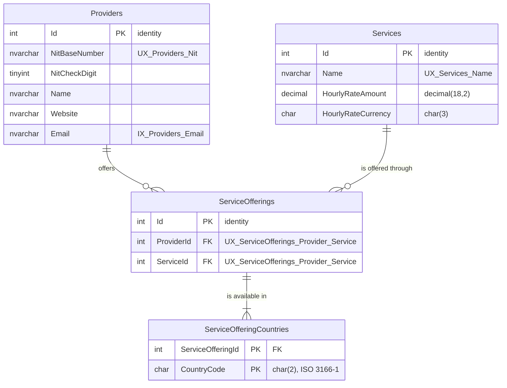

# ProviderHub

Web application to manage the services offered by TEKUS S.A.S. providers.

Technical test: .NET Fullstack (ASP.NET Core + Angular).

## Stack

| Layer | Technology |
| --- | --- |
| Backend | .NET 10 / ASP.NET Core Web API |
| Persistence | Entity Framework Core + SQL Server 2022 |
| Frontend | Angular (standalone components) + Angular Material |
| Tests | xUnit |
| Local infrastructure | Docker Compose |

## Solution layout

The backend follows Clean Architecture with a DDD-oriented domain layer.
Dependencies always point inwards: nothing in `Domain` knows about the outside world.

```
ProviderHub.sln
├── src
│   ├── ProviderHub.Domain           Entities, value objects, business rules. No dependencies.
│   ├── ProviderHub.Application      Use cases, DTOs, validation. Declares the ports (interfaces).
│   ├── ProviderHub.Infrastructure   Adapters: EF Core, SMTP, external services.
│   └── ProviderHub.Api              HTTP endpoints, authentication, DI composition root.
└── tests
    ├── ProviderHub.Domain.Tests           Business rules. No dependencies, milliseconds.
    ├── ProviderHub.Application.Tests      Use cases against in-memory repositories.
    ├── ProviderHub.Infrastructure.Tests   Mapping, indexes and SQL, against a real SQL Server.
    └── ProviderHub.Api.IntegrationTests   End to end, over HTTP.
```

`Api` is the only project allowed to reference `Infrastructure`, and it does so purely to
register implementations in the DI container at startup.

## Domain model

```
Provider (aggregate root)          Service (aggregate root)
  Nit          value object          Name
  Name                               HourlyRate   value object (Money)
  Website      value object
  Email        value object
  Offerings ──┐
              │
              └── ServiceOffering (entity, inside the Provider aggregate)
                    ServiceId   ──────────────────────────► Service
                    Countries   value objects (CountryCode)
```

Two decisions are worth calling out, because the statement of the test does not settle them.

**Where the country lives.** The test asks for indicators "by country" but never defines a
country field on any entity. It is modelled here on the relationship: a provider offers a given
service in a given set of countries. A provider may therefore offer consulting across Colombia
and Mexico while offering auditing only in Peru, which is both closer to reality and what makes
the two summary indicators answerable. The consequence is that `ServiceOffering` is a real
entity carrying its own data, not a plain join row.

**Why `Service` is its own aggregate root.** Several providers can offer the same catalogue
entry, so a service exists independently of any provider. Offerings reference it by identifier
rather than holding it, which keeps the two aggregates loosely coupled: one transaction changes
one aggregate.

Country codes follow ISO 3166-1 alpha-2 so that the indicators aggregate reliably; free text
would turn "Colombia", "colombia" and "COL" into three different countries. NIT check digits are
verified with the official algorithm rather than merely stored.

## Use cases

Each operation the system can perform is one class in `Application`, holding its command, its
validator and its handler in a single file. The list of files under `UseCases` is therefore the
list of things the system does.

**No mediator.** A mediator was considered and left out: with eleven use cases, `Send(command)`
only adds a layer of indirection over calling the handler, at the cost of losing compile-time
knowledge of who handles what. MediatR would also have brought a licence (RPL-1.5, or
commercial) that a project this size does not need to take on. The pattern it usually carries,
one handler per use case, is applied here directly.

**Validation happens twice, on purpose.** `Application` validates the incoming request with
FluentValidation so the caller receives a single `400` listing every field that is wrong.
`Domain` validates again when building its value objects, because it cannot trust that it is
only ever called through the API. The rules are not written twice: the validators ask the domain
to build the value and report its message, so a rule like the NIT check digit exists in exactly
one place.

**Errors are expressed in the language of the application**, not of HTTP: `NotFoundException`,
`ConflictException` and FluentValidation's `ValidationException`. Turning them into 404, 409 and
400 is the API layer's job, which keeps the use cases runnable from a job or a test.

## API

| Verb | Route | What it does |
| --- | --- | --- |
| GET | `/api/providers` | List, paged, searchable and sortable |
| POST | `/api/providers` | Register a provider |
| GET | `/api/providers/{id}` | One provider with everything it offers |
| PUT | `/api/providers/{id}` | Edit its identifying and contact details |
| POST | `/api/providers/{id}/services` | Enable a service in a set of countries |
| PUT | `/api/providers/{id}/services/{serviceId}` | Replace the countries of an offering |
| DELETE | `/api/providers/{id}/services/{serviceId}` | Stop offering a service |
| GET | `/api/services` | Catalogue, paged, searchable and sortable |
| POST | `/api/services` | Add a catalogue entry |
| GET | `/api/services/{id}` | One catalogue entry |
| PUT | `/api/services/{id}` | Edit its name or hourly rate |
| GET | `/api/{providers\|services}/sort-fields` | Which fields that list can be sorted by |
| POST | `/api/auth/login` | Exchange credentials for a token. The only anonymous endpoint |
| GET | `/api/auth/me` | Who the current token belongs to |

Every list accepts `?page=&pageSize=&search=&sortBy=&direction=asc|desc`, and answers with the
rows plus `totalCount`, `totalPages`, `hasNextPage` and `hasPreviousPage`, so a client can render
a pager without a second request or a guess.

**Failures are always `ProblemDetails`** (RFC 9457), whichever endpoint produced them. The
translation from the language of the application to status codes happens in one place, so no
endpoint can forget it and no two endpoints can disagree:

| Raised by a use case | Answer |
| --- | --- |
| `ValidationException` | `400` with an `errors` object, one entry per field |
| `InvalidCredentialsException` | `401`, with the same message whichever half was wrong |
| `NotFoundException` | `404` |
| `ConflictException` | `409` |
| `DomainException` | `400`, and a log entry: a validator upstream is missing |
| anything else | `500` with no detail, and the exception in the logs |

A rejected request names every problem at once rather than the first one:

```json
{
  "title": "One or more validation errors occurred.",
  "status": 400,
  "errors": {
    "nit": ["The check digit of NIT '890903938-1' is wrong, expected 8."],
    "name": ["'Name' must not be empty."],
    "website": ["'javascript:alert(1)' must use the http or https scheme."],
    "email": ["'not-an-email' is not a valid e-mail address."]
  }
}
```

Interactive documentation is served at `/scalar/v1` in development, generated from the OpenAPI
document and the XML comments on the controllers.

## Authentication

The test asks for an authentication mechanism and explicitly does not ask for user
administration, so there is one user, defined in configuration, and no way to create more.

```bash
curl -X POST http://localhost:5199/api/auth/login -H "Content-Type: application/json" -d "{\"userName\":\"admin\",\"password\":\"Tekus2026!\"}"
```

The response carries a JWT to send back as `Authorization: Bearer <token>` on every other
endpoint. In the documentation page, paste it into the **Authorize** box.

Four decisions here are worth more than the code that implements them:

**Authorization is the default, not an opt-in.** A global filter requires an authenticated user,
and `[AllowAnonymous]` waives it on the login endpoint alone. The other way round, an endpoint
added next month is public until somebody remembers to protect it, and nothing fails to remind
them.

**The password is never stored.** Configuration holds a PBKDF2-HMAC-SHA256 hash with a random
salt and 210,000 iterations, in a self-describing `iterations.salt.hash` format so the cost can
be raised later without invalidating what already exists. Verification compares in constant time,
because the duration of a rejection should not reveal how close a guess was.

**A wrong username and a wrong password fail identically.** Distinguishing them turns the login
form into a way of discovering which accounts exist.

**Every validation the token library offers is switched on**: issuer, audience, signature and
lifetime, with the default five minutes of clock skew cut to thirty seconds. Each of these is off
by default in somebody's tutorial, and each one left off turns the token into a decoration.

Secrets live in `appsettings.Development.json` for local work only; `appsettings.json` carries no
signing key, so a deployment must supply one through the environment and fails at startup if it
does not.

## Database



Value objects are mapped as owned types, which keeps their parts as real columns: a value
converter would collapse `Nit` into an opaque string that no query could look inside, and
searching by tax identifier is a requirement. `Money` becomes an amount and a currency column,
`decimal(18,2)` rather than a float, because money in binary floating point is how a total ends
up one cent off with nobody able to explain why.

Three constraints are enforced by the database and not only by the code: a NIT is unique across
providers, a provider offers a given service once, and a catalogue service that providers still
offer cannot be deleted. The use cases check the first two before saving, but only an index wins
the race between two simultaneous requests.

Two scripts live in [`db/`](db) and are the deliverable the test asks for:

| File | What it is |
| --- | --- |
| `db/schema.sql` | Full schema, generated from the EF Core migration and idempotent. |
| `db/seed.sql` | Sample data: 12 services, 10 providers, 26 offerings, 48 country rows. Idempotent, and every NIT carries its real check digit. |

## Repository conventions

- `global.json` pins the .NET SDK so every machine builds with the same toolchain.
- `Directory.Build.props` holds the compiler settings shared by all projects
  (nullable reference types, warnings as errors, analyzers).
- `Directory.Packages.props` centralizes every NuGet version
  ([Central Package Management](https://learn.microsoft.com/en-us/nuget/consume-packages/central-package-management)).

## Getting started

Start the database, create the schema and load the sample data:

```bash
docker compose up -d
dotnet ef database update --project src/ProviderHub.Infrastructure
docker exec -i providerhub-sqlserver /opt/mssql-tools18/bin/sqlcmd -S localhost -U sa -P 'ProviderHub!2026' -C -d ProviderHub -b < db/seed.sql
```

Then run the API and open <http://localhost:5199/scalar/v1>:

```bash
dotnet run --project src/ProviderHub.Api
```

Or build and run the tests:

```bash
dotnet build
dotnet test
```

The unit tests need nothing but the .NET SDK. The persistence tests need the container: without
it they are skipped rather than failed, so cloning the repository and running `dotnet test` never
looks like broken code.

## Requirements coverage

Tracked as the implementation progresses.

- [x] Structured solution, separated projects, DDD-oriented design
- [x] Provider and Service entities, business rules and unit tests
- [x] Persistence: EF Core mapping, repositories, migrations
- [x] RESTful API
- [x] Pagination, sorting and search on every list
- [x] Authentication
- [ ] E-mail notification when a service is created
- [ ] Summary endpoint with two indicators
- [x] Input validation
- [ ] Unit and integration tests
- [ ] Angular frontend on top of a pre-existing design system
- [x] Database schema diagram
- [x] Database creation and seed scripts
